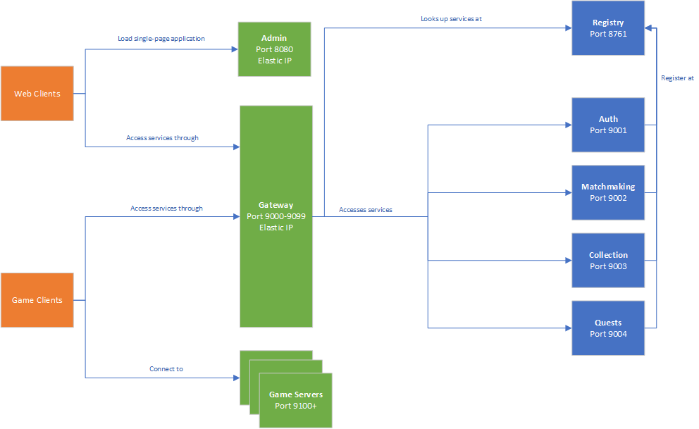
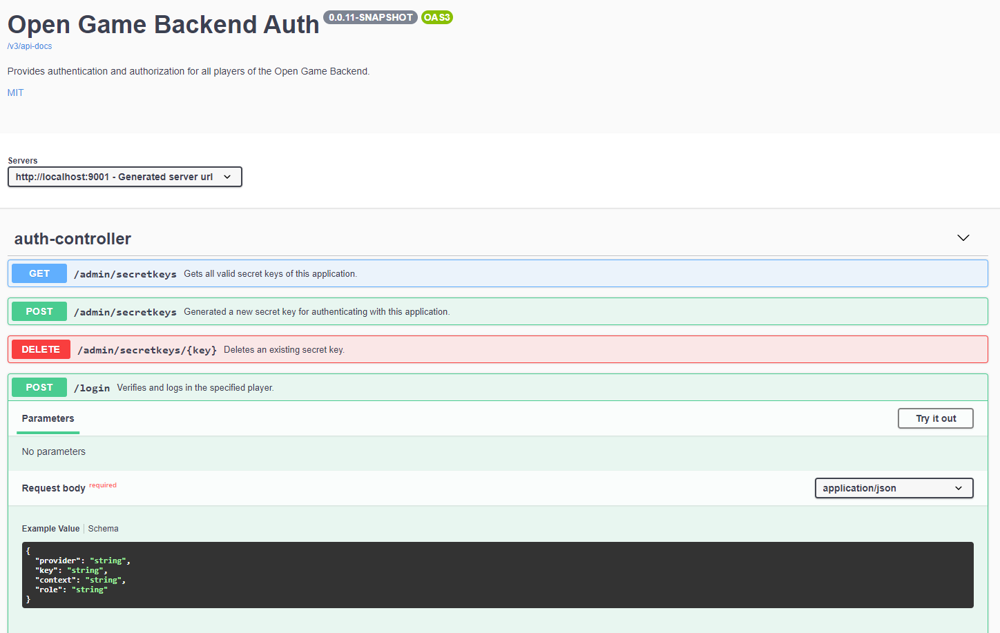
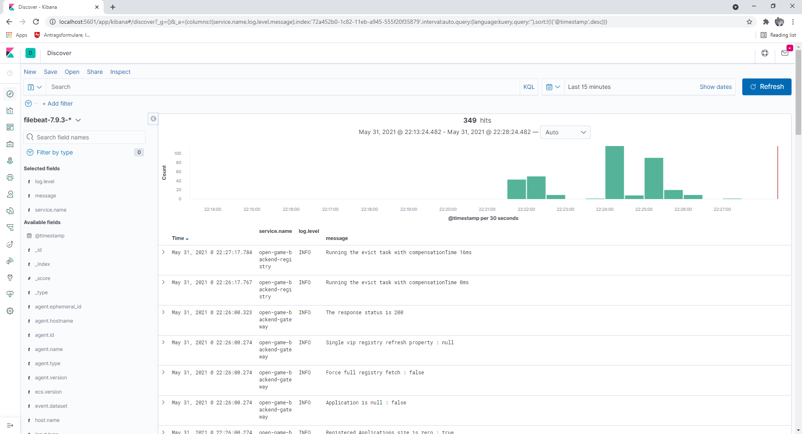
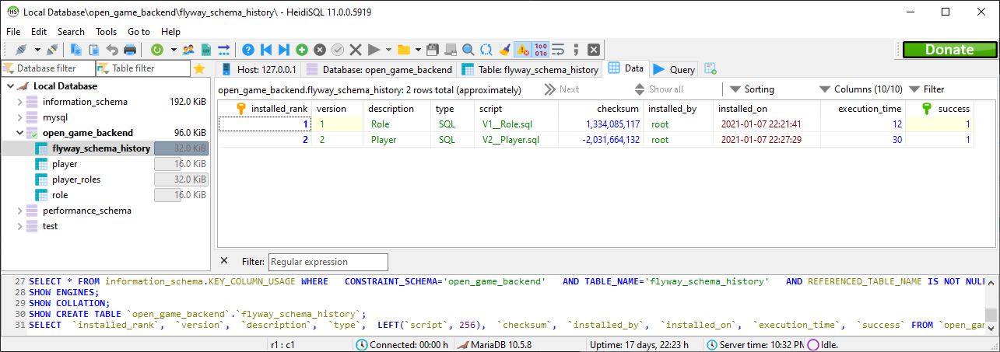
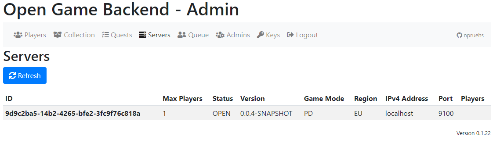
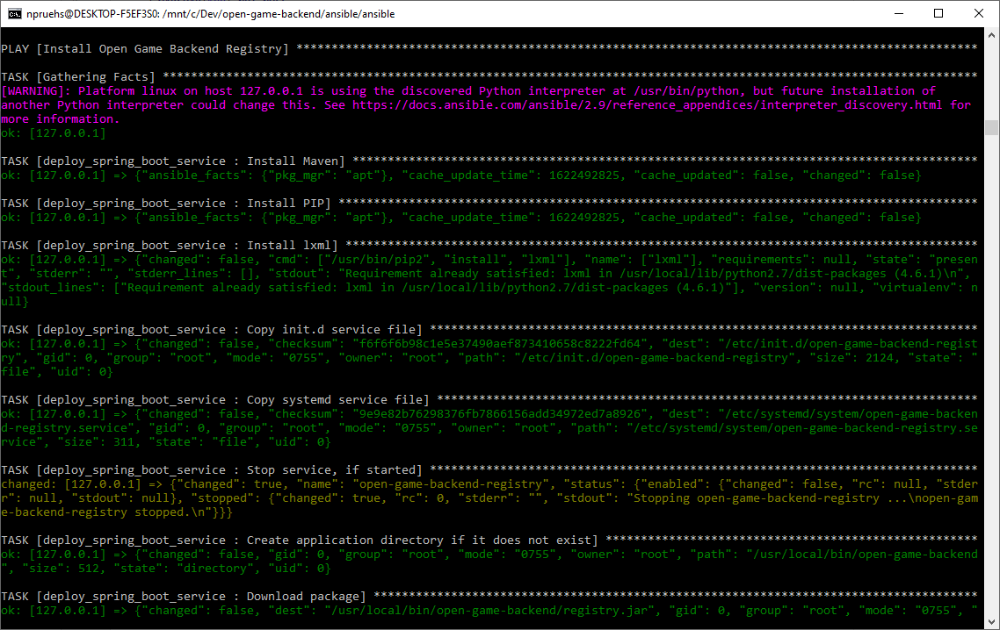

# Open Game Backend

The _Open Game Backend_ is the effort of creating an open-source microservice gaming backend, using well-known and widely accepted Java programming models (no esoteric programming languages), and allowing you to modify the code and scale the application to meet your needs (no software-as-a-service).

## Application Architecture

The _Open Game Backend_ currently consists of the following services:

* _registry_ - Service registry based on [Netflix Eureka](https://github.com/Netflix/eureka).
* _gateway_ - API gateway based on [Netflix Zuul](https://github.com/Netflix/zuul).
* _auth_ - Allows players, admins and servers to access your backend using [OAuth2](https://oauth.net/2/).
* _matchmaking_ - Allows game server instances to register, and match players to these servers.
* _collection_ - Allows admins and servers to grant items to players, and players to create loadouts with these items.
* _quests_ - Allows generating daily or weekly quests for players, and players to complete these quests for rewards.

All services are based on [Spring Boot](https://spring.io/projects/spring-boot), which provides many essential features such as embedded Tomcat servers or externalized configuration, without causing too much overhead.

While the whole application has been designed with the Amazon AWS cloud in mind, you're free to deploy it to any other cloud, or even to a single bare-metal machine if you want to. However, with the cloud in mind, a feasible multi-node setup looks as follows:

The microservices (blue) are entirely hidden from web and game clients. They register with a service registry for discovery, making it unnecessary to allocate fixed IPs for them.

Game clients (orange) access the services through the API gateway, which provides a fixed public IP, and forwards all requests to the respective services after consulting with the auth service. Web clients can access an admin dashboard, which is provided as a single-page application at a fixed public IP address as well. After having loading the single-page application, web clients will just access the backend services through the API gateway as well, much like the game clients.

Your game servers will need public IP addresses as well (green), but these don't need to be fixed, as game clients will be able to look them up through the matchmaking service.

## API Documentation

The whole application is using [Swagger](https://swagger.io/tools/swagger-ui/) to expose API documentation. You can access that documentation through the usual Swagger endpoints, i.e. `http://localhost:9001/swagger-ui/index.html?configUrl=/v3/api-docs/swagger-config#/` when running the _auth_ service locally.

## Logging

The backend is using the [Elastic Stack](https://www.elastic.co/elastic-stack) for writing logs and providing you access to these logs.

The services are using the [Zalando Logbook](https://github.com/zalando/logbook) library for automatic logging of all REST API requests and responses.

## Databases

All services are using a [H2 database](https://www.h2database.com/html/main.html) for local development, and [MariaDB](https://mariadb.org/) in production by default. Clearly, you're free to use any other database of your choice - just add the corresponding JDBC driver and you'd be good to go.

Database migrations are handled through the [Flyway](https://flywaydb.org/) middleware.

## Admin Dashboard

_Open Game Backend_ comes with an admin dashboard based on [Vue.js](https://vuejs.org/). The dashboard allows you to support your players, set up item collections and quests, and monitor your game servers and matchmaking queue.

## Deployment

To deploy the backend, you can use the shipped [Ansible](https://www.ansible.com/) playbooks - either by running them directly, or by using them as reference for your own deployment process.

